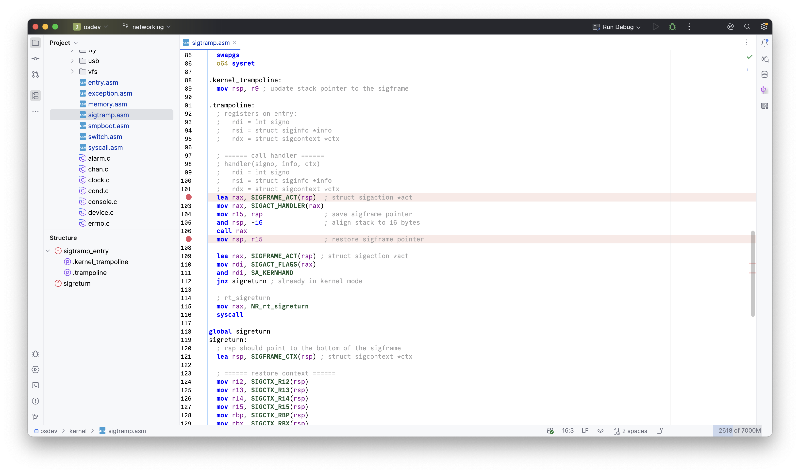

# Enhanced NASM x86_64 Assembly Support

> This project was built with Claude Code.

A JetBrains IDE plugin providing comprehensive IDE support for NASM x86_64 assembly language.



## Features

- **Syntax Highlighting**: Advanced syntax highlighting with semantic validation
- **Code Completion**: Context-aware completion for instructions, registers, directives, and symbols
- **Documentation**: Hover documentation with instruction details, operand variants, and pseudocode
- **Navigation**: Go-to-definition and find usages for labels, macros, constants, and includes
- **Refactoring**: Rename refactoring with cross-file support
- **Preprocessor**: Full support for macros, conditionals, includes, and command-line defines
- **Inspections**: Unused symbols, inactive preprocessor branches, macro redefinitions
- **Structure View**: Hierarchical outline of sections, macros, and labels
- **CLion Integration**: Native debugger support (GDB/LLDB) and bidirectional C/C++ cross-language navigation

## TODO Features

- **Instruction Operand Validation**: Validate operand types and counts for instructions
- **Expanded Instruction Documentation**: Add documentation for more instructions
- **16-bit and 32-bit Validation**: Enforce bitness-specific rules and instructions
- **Support %if in preprocessor branch inspection**: Implement const-expr evaluation to enable analysis of `%if` directives
- **[CLion] Project Model Integration**: Automatically detect compilation flags and include paths from CMake and Makefiles

## Supported IDEs

- All IntelliJ-based IDEs (IntelliJ IDEA, CLion, PyCharm, WebStorm, etc.)
- Platform version 2025.2 and greater
- Additional features available when using CLion

## Installation

1. Download the plugin from the JetBrains Marketplace
2. Or build from source (see Development section)

## Development

### Prerequisites

- JDK 21 or later
- IntelliJ IDEA (for development)

### Building the Plugin

```bash
./gradlew buildPlugin
```

The plugin will be created in `build/distributions/`.

### Running the Plugin in Development

```bash
./gradlew runIde
```

This will start a new IntelliJ IDEA instance with the plugin installed.

### Running Tests

```bash
./gradlew test
```

## License

This project is licensed under the MIT License - see the LICENSE file for details.
